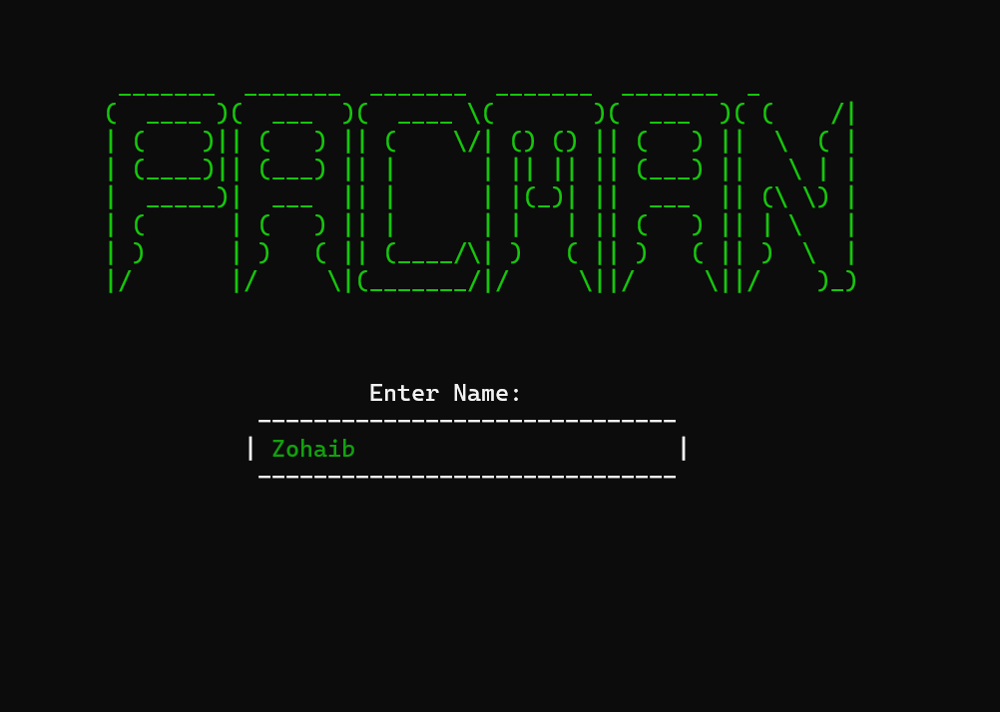
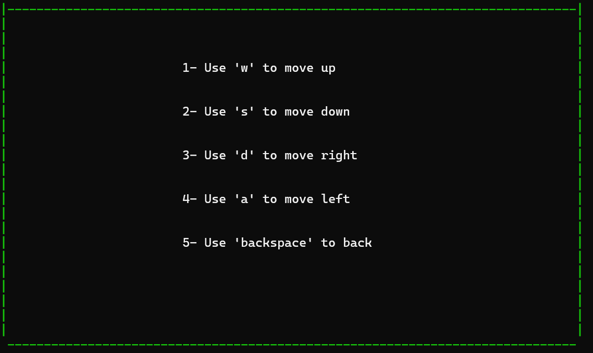
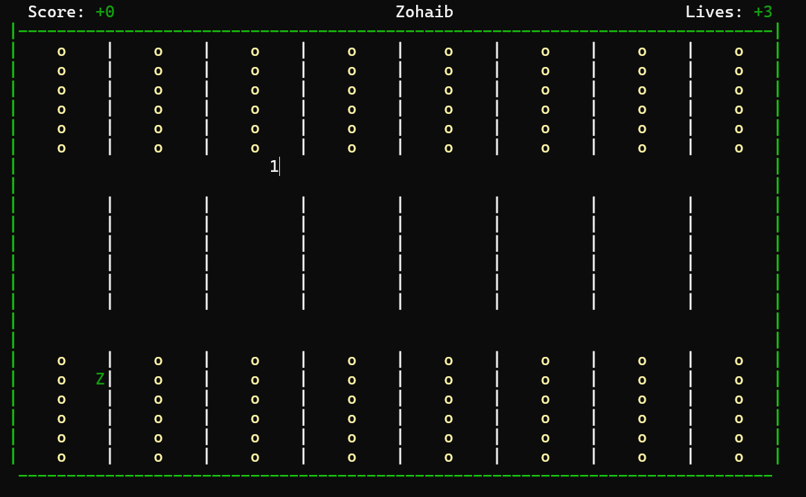

# PacMan Game – Assembly Language (MASM)

## Description
This project is a PacMan-style game developed in **x86 Assembly Language** using **MASM** and the **Irvine32 library**.
It was created as part of the **Computer Organization and Assembly Language (COAL)** course.

The game demonstrates low-level programming concepts such as memory management, procedures, keyboard input, sound handling, and game loops.

---

## Features
- Player movement using keyboard input
- Sound effects using `PlaySound` (winmm.lib)
- Score tracking
- Game over condition
- Modular assembly code structure

---

## Tools & Technologies
- Microsoft Visual Studio 2022
- MASM (Microsoft Macro Assembler)
- Irvine32 Library
- Windows API (`winmm.lib`)
- x86 (32-bit) architecture

---

## Project Structure
PacMan/
├── main.asm
├── music/
│ ├── *.wav
├── PacMan.vcxproj
├── PacMan.vcxproj.filters
└── PacMan.sln


---

## How to Build & Run

### Requirements
- Windows OS
- Visual Studio 2022
- MASM (installed with C++ workload)
- Irvine32 Library
- Project must be built in **x86 (32-bit)** mode

### Steps
1. Clone the repository:
   ```bash
   git clone https://github.com/your-username/PacMan.git

2. Open PacMan.sln in Visual Studio 2022

3. Select x86 as the platform

4. Build the solution (Ctrl + Shift + B)

5. Run without debugging (Ctrl + F5)

---

## Notes

This project uses Irvine32, which is compatible only with 32-bit (x86) builds.
Audio files must remain in the music/ directory for sound playback to work correctly.

Author
Zohaib Han
Computer Science Student


---

## Screenshots

 
 
 
